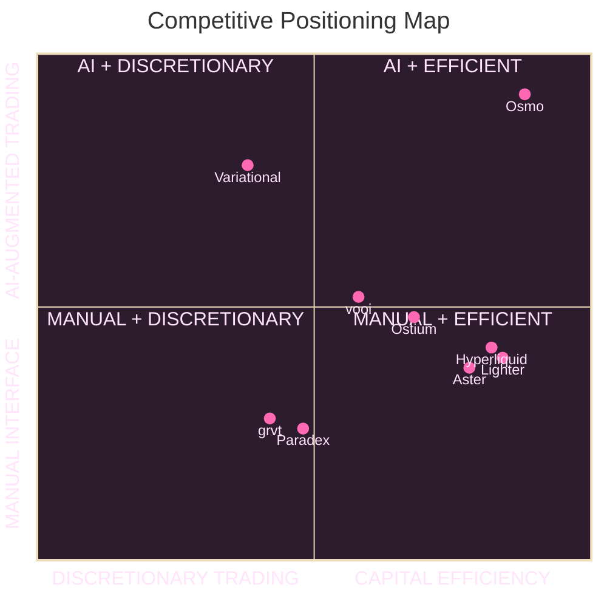

# OSMO Web Frontend

Frontend dApp for trading, portfolio, leaderboard/arena, and AI-assisted chart workflow.

Repository: https://github.com/TradeWithOsmo/osmo-web

## Stack

- React 19 + TypeScript
- Vite
- Zustand + React Query
- TradingView Advanced Chart integration
- Playwright (E2E)
- Storybook

## Prerequisites

- Node.js 20+
- npm 10+

## Setup

```bash
npm install
```

Create `.env` in project root (`v1-web/.env`) and set values for your environment.

Common variables:
- `VITE_API_URL` (default fallback in code: `http://localhost:8000`)
- `VITE_PRIVY_APP_ID`
- `VITE_TRADING_EXCHANGE` (`simulation`, `onchain`, or your runtime setting)
- `VITE_ARENA_END_ISO`
- `VITE_TV_COMMAND_POLL_MS`
- `VITE_TV_INITIAL_SYNC_MS`
- `VITE_TV_SET_RESOLUTION_TIMEOUT_MS`

On-chain contract variables used by frontend:
- `VITE_CONTRACT_TRADING_VAULT`
- `VITE_CONTRACT_ORDER_ROUTER`
- `VITE_CONTRACT_POSITION_MANAGER`
- `VITE_CONTRACT_SESSION_KEY_MANAGER`
- `VITE_CONTRACT_OSTIUM_ADAPTER`
- `VITE_CONTRACT_USDC`
- `VITE_CONTRACT_FAUCET`
- `VITE_CONTRACT_AI_VAULT`
- `VITE_CONTRACT_ARENA_CHOOSE_SIDE`
- `VITE_CONTRACT_ARENA_POINTS`

## Run

```bash
npm run dev
```

App runs at `http://localhost:5173`.

## Scripts

```bash
npm run dev
npm run start
npm run build
npm run preview
npm run lint
npm run test:e2e
npm run storybook
npm run build-storybook
```

## Project Areas

- `src/pages/` - Trade, Portfolio, Arena, Leaderboard, Usage, Faucet
- `src/components/` - UI modules (order form, positions, chat, modals, chart, etc.)
- `src/api/` - API clients (`orders`, `portfolio`, `leaderboard`, `agent`, `usage`, `onchain`)
- `src/charting/` - TradingView datafeeds, command handlers, and chart utilities
- `src/contracts/abis/` - smart contract ABI files consumed by the UI
- `src/store/` - global state stores

## Mermaid Diagram



## TradingView Library Note

TradingView charting library artifacts are intentionally not committed in full.  
Ensure required files are available under:
- `public/charting_library/`
- `src/charting/charting_library/`

## Notes

- This frontend expects backend API/WebSocket services running (usually from `backend/websocket` on port `8000`).
- For arena and leaderboard behavior, confirm backend migration/data seeding is complete.
